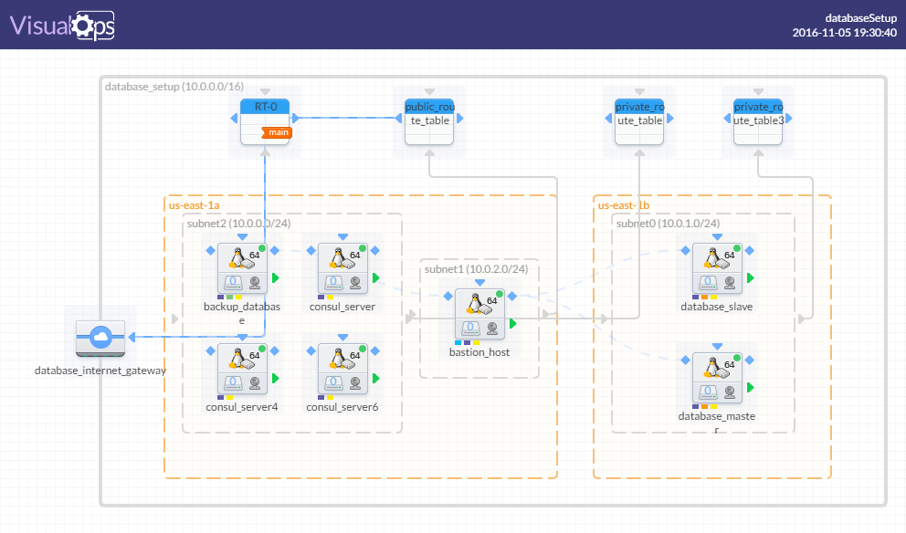

Sometimes it is a requirement to utilize EC2 instead of RDS for database servers. 

This projects utilizes terraform to deploy MariaDB or MySQL database servers on EC2 on AWS.

It applies backups, disaster recovery, high availability and fault tolerance to these servers when they are running on EC2. 

This includes all of those requirements and build out the architecture starting from the VPC all from scratch.

#### Infrastructure Design Overview

#### Service Discovery, Monitoring & Health Checks

#### configuration Plan
